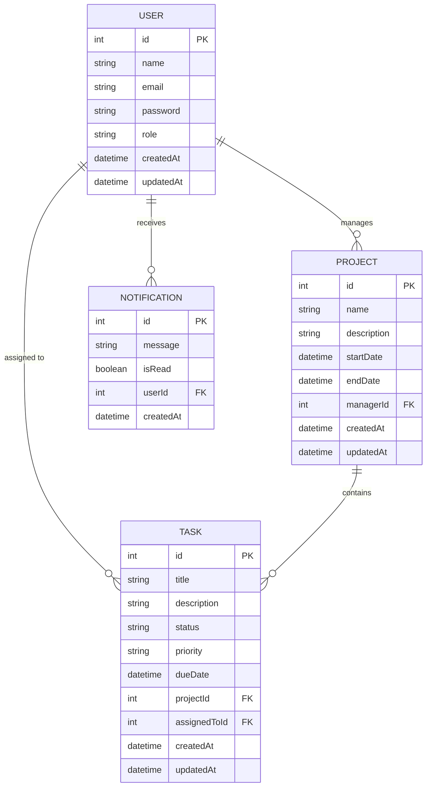

# Entity Relationship (ER) Diagram

## Entities and Attributes

### users
- id (Primary Key, Auto Increment)
- name (String)
- email (String, Unique)
- password (String, Hashed)
- role (String: ADMIN | MANAGER | EMPLOYEE)
- createdAt, updatedAt (Timestamps)

### projects
- id (Primary Key)
- name (String)
- description (String, Optional)
- startDate (DateTime, Optional)
- endDate (DateTime, Optional)
- managerId (Foreign Key → users.id)
- createdAt, updatedAt (Timestamps)

### tasks
- id (Primary Key)
- title (String)
- description (String, Optional)
- status (String: TODO | IN_PROGRESS | REVIEW | COMPLETED)
- priority (String: LOW | MEDIUM | HIGH)
- dueDate (DateTime, Optional)
- projectId (Foreign Key → projects.id)
- assignedToId (Foreign Key → users.id, Optional)
- createdAt, updatedAt (Timestamps)

### notifications
- id (Primary Key)
- message (String)
- isRead (Boolean, Default: false)
- userId (Foreign Key → users.id)
- createdAt (Timestamp)

## Relationships
- One user can manage many projects (1:N)
- One user can be assigned many tasks (1:N)
- One project can have many tasks (1:N)
- One user can receive many notifications (1:N)
- Tasks cascade-delete when a project is deleted