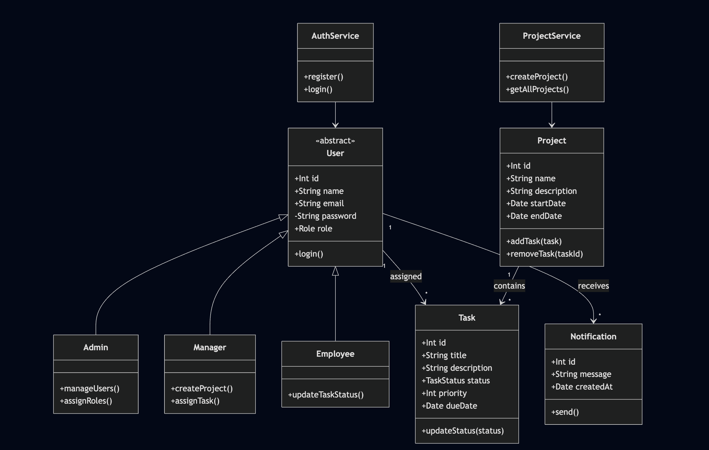

# Class Diagram

## User (Abstract Class)
- id: string
- name: string
- email: string
- password: string
- role: Role
+ login(): void

## Admin extends User
+ manageUsers(): void
+ assignRoles(): void

## Manager extends User
+ createProject(): void
+ assignTask(): void

## Employee extends User
+ updateTaskStatus(): void

## Project
- id: string
- name: string
- description: string
- startDate: Date
- endDate: Date
+ addTask(task: Task): void
+ removeTask(taskId: string): void

## Task
- id: string
- title: string
- description: string
- status: TaskStatus
- priority: number
- dueDate: Date
+ updateStatus(status: TaskStatus): void

## Notification
- id: string
- message: string
- createdAt: Date
+ send(): void

## Relationships
- User (1) → (*) Task
- Project (1) → (*) Task
- User (1) → (*) Notification