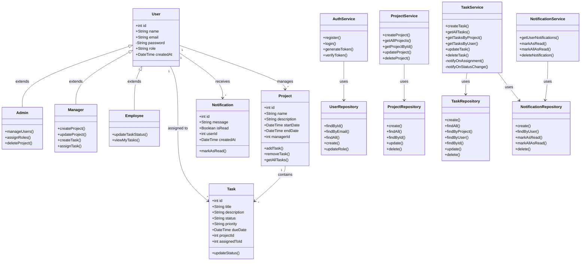

# Class Diagram

```mermaid
classDiagram
    class User {
        +int id
        +String name
        +String email
        -String password
        +String role
        +DateTime createdAt
    }

    class Admin {
        +manageUsers()
        +assignRoles()
        +deleteProject()
    }

    class Manager {
        +createProject()
        +updateProject()
        +createTask()
        +assignTask()
    }

    class Employee {
        +updateTaskStatus()
        +viewMyTasks()
    }

    class Project {
        +int id
        +String name
        +String description
        +DateTime startDate
        +DateTime endDate
        +int managerId
        +addTask()
        +removeTask()
        +getAllTasks()
    }

    class Task {
        +int id
        +String title
        +String description
        +String status
        +String priority
        +DateTime dueDate
        +int projectId
        +int assignedToId
        +updateStatus()
    }

    class Notification {
        +int id
        +String message
        +Boolean isRead
        +int userId
        +DateTime createdAt
        +markAsRead()
    }

    class AuthService {
        +register()
        +login()
        +generateToken()
        +verifyToken()
    }

    class ProjectService {
        +createProject()
        +getAllProjects()
        +getProjectById()
        +updateProject()
        +deleteProject()
    }

    class TaskService {
        +createTask()
        +getAllTasks()
        +getTasksByProject()
        +getTasksByUser()
        +updateTask()
        +deleteTask()
        -notifyOnAssignment()
        -notifyOnStatusChange()
    }

    class NotificationService {
        +getUserNotifications()
        +markAsRead()
        +markAllAsRead()
        +deleteNotification()
    }

    class UserRepository {
        +findById()
        +findByEmail()
        +findAll()
        +create()
        +updateRole()
    }

    class ProjectRepository {
        +create()
        +findAll()
        +findById()
        +update()
        +delete()
    }

    class TaskRepository {
        +create()
        +findAll()
        +findByProject()
        +findByUser()
        +findById()
        +update()
        +delete()
    }

    class NotificationRepository {
        +create()
        +findByUser()
        +markAsRead()
        +markAllAsRead()
        +delete()
    }

    User <|-- Admin : extends
    User <|-- Manager : extends
    User <|-- Employee : extends

    Project "1" --> "*" Task : contains
    User "1" --> "*" Task : assigned to
    User "1" --> "*" Notification : receives
    User "1" --> "*" Project : manages

    AuthService --> UserRepository : uses
    ProjectService --> ProjectRepository : uses
    TaskService --> TaskRepository : uses
    TaskService --> NotificationRepository : uses
    NotificationService --> NotificationRepository : uses
```

## Design Patterns Used

### Repository Pattern
Each domain entity has a dedicated repository class that encapsulates all database operations:
- `UserRepository`, `ProjectRepository`, `TaskRepository`, `NotificationRepository`

### Service Layer Pattern
Business logic lives in service classes, keeping controllers thin:
- `AuthService`, `ProjectService`, `TaskService`, `NotificationService`

### Observer-like Notification
`TaskService` automatically creates notifications when:
- A task is assigned to a user
- A task's status changes

### Role-Based Access Control (Strategy Pattern)
The `authorize` middleware accepts roles dynamically and enforces access at the route level.