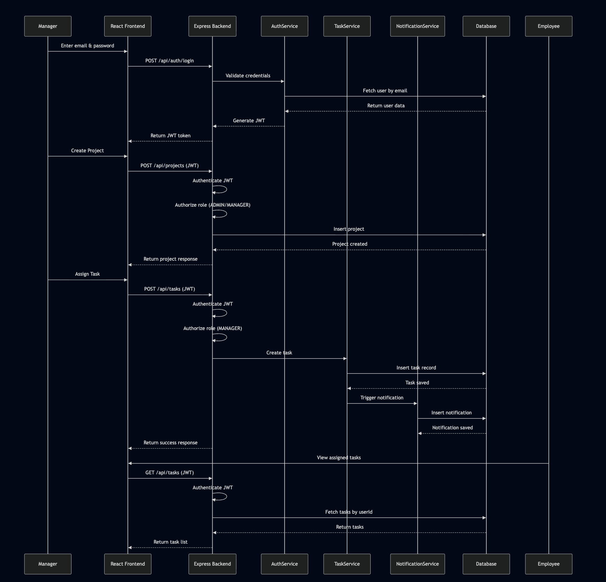

# Sequence Diagram – Task Assignment Flow

## Description
This sequence diagram represents the end-to-end flow of assigning a task to an employee by a manager.

## Steps
1. Manager logs into the application.
2. Frontend sends authentication request to the backend.
3. Backend validates credentials and returns a JWT token.
4. Manager creates a project.
5. Manager assigns a task to an employee.
6. Backend validates request and stores task in the database.
7. Notification service generates a notification.
8. Employee retrieves and views the assigned task.

## Participants
- Manager
- Frontend (React)
- Backend API (Express)
- Authentication Service
- Task Service
- Notification Service
- Database