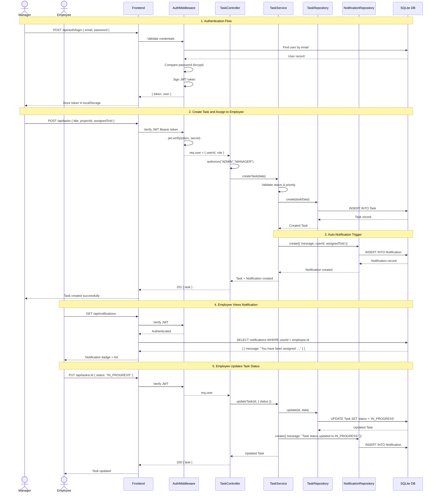
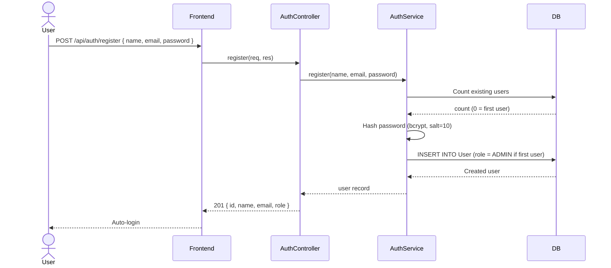

# Sequence Diagram

## Main Flow: Task Creation with Auto-Notification

```mermaid
sequenceDiagram
    actor Manager
    actor Employee
    participant Frontend
    participant AuthMiddleware
    participant TaskController
    participant TaskService
    participant TaskRepository
    participant NotificationRepository
    participant DB as SQLite DB

    Note over Manager, DB: 1. Authentication Flow
    Manager->>Frontend: POST /api/auth/login { email, password }
    Frontend->>AuthMiddleware: Validate credentials
    AuthMiddleware->>DB: Find user by email
    DB-->>AuthMiddleware: User record
    AuthMiddleware->>AuthMiddleware: Compare password (bcrypt)
    AuthMiddleware->>AuthMiddleware: Sign JWT token
    AuthMiddleware-->>Frontend: { token, user }
    Frontend-->>Manager: Store token in localStorage

    Note over Manager, DB: 2. Create Task and Assign to Employee
    Manager->>Frontend: POST /api/tasks { title, projectId, assignedToId }
    Frontend->>AuthMiddleware: Verify JWT Bearer token
    AuthMiddleware->>AuthMiddleware: jwt.verify(token, secret)
    AuthMiddleware-->>TaskController: req.user = { userId, role }
    TaskController->>TaskController: authorize("ADMIN","MANAGER")
    TaskController->>TaskService: createTask(data)
    TaskService->>TaskService: Validate status & priority
    TaskService->>TaskRepository: create(taskData)
    TaskRepository->>DB: INSERT INTO Task
    DB-->>TaskRepository: Task record
    TaskRepository-->>TaskService: Created Task

    Note over TaskService, DB: 3. Auto-Notification Trigger
    TaskService->>NotificationRepository: create({ message, userId: assignedToId })
    NotificationRepository->>DB: INSERT INTO Notification
    DB-->>NotificationRepository: Notification record
    NotificationRepository-->>TaskService: Notification created

    TaskService-->>TaskController: Task + Notification created
    TaskController-->>Frontend: 201 { task }
    Frontend-->>Manager: Task created successfully

    Note over Employee, DB: 4. Employee Views Notification
    Employee->>Frontend: GET /api/notifications
    Frontend->>AuthMiddleware: Verify JWT
    AuthMiddleware-->>Frontend: Authenticated
    Frontend->>DB: SELECT notifications WHERE userId = employee.id
    DB-->>Frontend: [ { message: "You have been assigned: ..." } ]
    Frontend-->>Employee: Notification badge + list

    Note over Employee, DB: 5. Employee Updates Task Status
    Employee->>Frontend: PUT /api/tasks/:id { status: "IN_PROGRESS" }
    Frontend->>AuthMiddleware: Verify JWT
    AuthMiddleware-->>TaskController: req.user
    TaskController->>TaskService: updateTask(id, { status })
    TaskService->>TaskRepository: update(id, data)
    TaskRepository->>DB: UPDATE Task SET status = 'IN_PROGRESS'
    DB-->>TaskRepository: Updated Task
    TaskService->>NotificationRepository: create({ message: "Task status updated to IN_PROGRESS" })
    NotificationRepository->>DB: INSERT INTO Notification
    TaskService-->>TaskController: Updated Task
    TaskController-->>Frontend: 200 { task }
    Frontend-->>Employee: Task updated
```

## Other Key Flows

### Register Flow

```mermaid
sequenceDiagram
    actor User
    participant Frontend
    participant AuthController
    participant AuthService
    participant DB

    User->>Frontend: POST /api/auth/register { name, email, password }
    Frontend->>AuthController: register(req, res)
    AuthController->>AuthService: register(name, email, password)
    AuthService->>DB: Count existing users
    DB-->>AuthService: count (0 = first user)
    AuthService->>AuthService: Hash password (bcrypt, salt=10)
    AuthService->>DB: INSERT INTO User (role = ADMIN if first user)
    DB-->>AuthService: Created user
    AuthService-->>AuthController: user record
    AuthController-->>Frontend: 201 { id, name, email, role }
    Frontend-->>User: Auto-login
```