# Use Case Diagram

```mermaid
flowchart TD
    Admin([👑 Admin])
    Manager([📊 Manager])
    Employee([👤 Employee])
    System([🔔 System])

    subgraph Auth["🔐 Authentication"]
        UC1[Register Account]
        UC2[Login]
        UC3[Logout]
    end

    subgraph UserMgmt["👥 User Management"]
        UC4[View All Users]
        UC5[Update User Role]
        UC6[View Own Profile]
    end

    subgraph ProjectMgmt["📁 Project Management"]
        UC7[Create Project]
        UC8[View All Projects]
        UC9[Update Project]
        UC10[Delete Project]
    end

    subgraph TaskMgmt["📋 Task Management"]
        UC11[Create Task]
        UC12[View All Tasks]
        UC13[View My Tasks]
        UC14[Update Task Status]
        UC15[Assign Task to User]
        UC16[Delete Task]
    end

    subgraph NotifMgmt["🔔 Notifications"]
        UC17[View Notifications]
        UC18[Mark Notification as Read]
        UC19[Mark All as Read]
        UC20[Delete Notification]
        UC21[Auto-Notify on Assignment]
        UC22[Auto-Notify on Status Change]
    end

    Admin --> UC1
    Admin --> UC2
    Admin --> UC3
    Admin --> UC4
    Admin --> UC5
    Admin --> UC6
    Admin --> UC7
    Admin --> UC8
    Admin --> UC9
    Admin --> UC10
    Admin --> UC11
    Admin --> UC12
    Admin --> UC14
    Admin --> UC15
    Admin --> UC16
    Admin --> UC17
    Admin --> UC18
    Admin --> UC19
    Admin --> UC20

    Manager --> UC1
    Manager --> UC2
    Manager --> UC3
    Manager --> UC6
    Manager --> UC7
    Manager --> UC8
    Manager --> UC9
    Manager --> UC11
    Manager --> UC12
    Manager --> UC14
    Manager --> UC15
    Manager --> UC16
    Manager --> UC17
    Manager --> UC18
    Manager --> UC19
    Manager --> UC20

    Employee --> UC1
    Employee --> UC2
    Employee --> UC3
    Employee --> UC6
    Employee --> UC8
    Employee --> UC13
    Employee --> UC14
    Employee --> UC17
    Employee --> UC18
    Employee --> UC19
    Employee --> UC20

    System --> UC21
    System --> UC22
```

## Actors
- **Admin**: Full system access — manages users, roles, all projects and tasks
- **Manager**: Creates/manages projects and tasks, assigns work to employees
- **Employee**: Views assigned tasks, updates task status, reads notifications
- **System**: Automated — creates notifications on task assignment/status changes

## Use Cases Summary

| Use Case | Admin | Manager | Employee |
|---|---|---|---|
| Register / Login | ✅ | ✅ | ✅ |
| View All Users | ✅ | ❌ | ❌ |
| Update User Role | ✅ | ❌ | ❌ |
| Create / Delete Project | ✅ | ✅ (create) | ❌ |
| View All Projects | ✅ | ✅ | ✅ |
| Create / Assign Task | ✅ | ✅ | ❌ |
| View All Tasks | ✅ | ✅ | ❌ |
| View My Tasks | ✅ | ✅ | ✅ |
| Update Task Status | ✅ | ✅ | ✅ |
| Manage Notifications | ✅ | ✅ | ✅ |